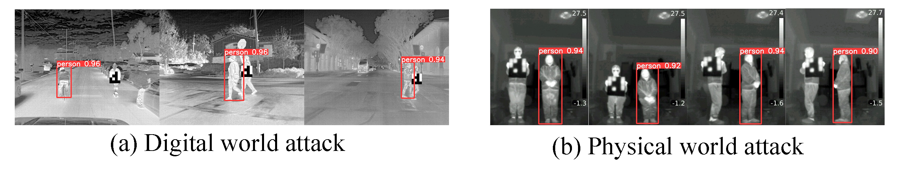

# Paa-Tee
Official Pytorch implementation for paper [Paa-Tee: A Practical Adversarial Attack on thermal infrared detectors with Temperature and Pose adaptability).



# Abstract
Infrared object detectors play an important role in security-related tasks, necessitating feasible adversarial attacks to evaluate their robustness. In many cases, implementing attacks in the physical space by a patch demands intricate and specialized perturbations. However, state-of-the-art adversarial attacks are often impractical as they require fixed perturbation location and are susceptible to environmental temperature, leading to attack effects that are overfitted to specific poses and environments. To address this, we propose a practical adversarial attack method named Paa-Tee, with two input transformation strategies. For poses, we continuously alter the patch's position to mitigate the impact of different poses on the patch's location. For temperature, leveraging the principles of thermal imaging, we apply various transformations to a single input image to simulate different attack environments. Meanwhile, we utilize hot and cold pastes as a low-resolution patch to implement attacks in the physical world. Extensive experiments validate the efficacy of our approach in both digital and physical worlds. In the digital world, our attack lowered the Average Precision of mainstream detectors by 65.44%. In the physical world, we achieve an average attack success rate of 63.77% under various distances, poses, angles, and environmental conditions. 
## Requirements
- python 3.8
- Pytorch 2.1.1
- At least 1x12GB NVIDIA GPU
## Preparation
1. Download the complete [FLIR ADAS Dataset](https://adas-dataset-v2.flirconservator.com/#downloadguide) and convert its annotation format to the YOLO format.
2. Filter out instances of "person" from the dataset, and keep only those instances with a height greater than 120 pixels.
3. Download the YOLOv5 pre-trained model. In this work, we use the [YOLOv5s.pt](https://github.com/ultralytics/yolov5).
4. Fine-tune the pre-trained YOLOv5 model on the "dataset/FLIR_ADAS".
### train and val
Once you have setup your path, you can get the patch by this:
```
python train_flir_patch.py
```
You will get the patch, then you can run the follow bash to attack the test set.
```
python evaluate_attack.py
```
To evaluate attack, you can go to （https://github.com/ultralytics/yolov5） for validation


## Acknowledgements
We would like to acknowledge the YOLOv5 open-source library (https://github.com/ultralytics/yolov5). YOLOv5 is a powerful object detection algorithm that has greatly facilitated our development efforts. We are grateful to the developers and contributors of YOLOv5 for making their work available to the community.